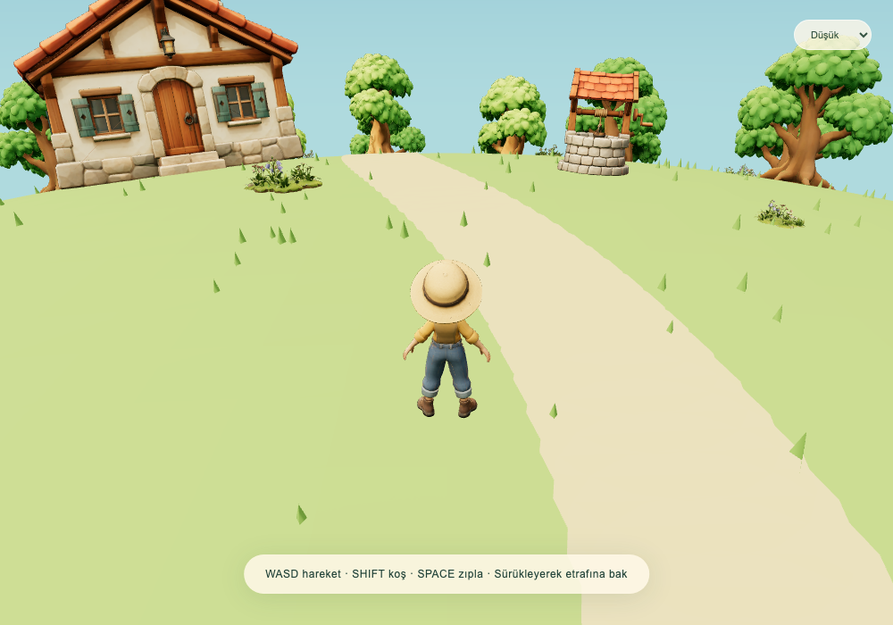

# ErenAILab · Tripo Cozy World

Bir görselden başlayıp içinde yürüyebildiğimiz küçük bir 3D dünya: **Tripo ile modeller, Astra ile Three.js oyun dünyası.**



## Hemen çalıştır

Node.js 22.12+ kurulu olsun. Bu repoyu klonlayın ve terminalde:

```bash
git clone https://github.com/erendikmenn/erenailab-tripo-cozy-world.git
cd erenailab-tripo-cozy-world
npm ci
npm run dev -- --port 4177
```

Tarayıcıda **http://localhost:4177** açın. Çalıştırmak için Tripo API anahtarı veya ücretli servis gerekmez; üretilmiş modeller repoda bulunur.

## Videodaki kaynaklar nerede?

- [Dünyayı oluşturmak için Astra promptu](ASTRA_TPV_WORLD_PROMPT.md)
- [Image-to-3D referans görselleri](asset-references/)
- [Tripo üretim rehberi](ASSET_GENERATION_GUIDE.md)
- [Karakter, ağaç, çiçek, kuyu ve ev modelleri (GLB)](public/assets/)
- [Three.js + TypeScript kaynak kodu](src/)

Kontroller: **WASD / yön tuşları** hareket, **Shift** koşu, **Space** zıplama; fareyi sürükleyerek kamera dönüşü.

Çit görseli alternatif bir tasarım referansıdır; bu demoda çit modeli kullanılmaz. Beş GLB model yüklenir. Karakterin yürüyüş animasyonu mevcut; koşu aynı yürüyüşün hızlandırılmış halidir. Ayrı koşu animasyonu değildir. Harita küçük bir prototiptir, sonsuz dünya değildir.

## Üretim ve doğrulama

```bash
npm test
npm run build
# Geliştirme sunucusu açıkken:
npx playwright install chromium
npm run test:browser
```

## Kaynak ve kullanım notları

Kod ve bu video için oluşturduğumuz referans görselleri/modelleri birlikte inceleyip kendi denemelerinize başlangıç olarak kullanabilirsiniz. Model üretimini tekrarlamak Tripo hesabı/kredisi gerektirebilir. Tripo servis koşulları ve üçüncü taraf bağımlılıkların kendi lisansları geçerlidir. Bu repo herhangi bir üçüncü taraf oyunun kodunu veya modelini içermez.

Video Tripo ile ücretli iş birliği kapsamında hazırlanmıştır.

---

## Technical notes

# ErenAILab · Little Meadow

A Three.js + TypeScript third-person curved-world exploration demo. No quests, counters, scoring or collectible mechanic.

`npm install` → `npm run dev -- --port 4177`. Production: `npm run build`. Unit tests: `npm test`. Browser smoke with dev running: `npm run test:browser` (install Chromium with `npx playwright install chromium` if needed).

Controls: WASD/arrows camera-relative movement; Shift runs; Space jumps; drag mouse/touch to orbit. Touch directional buttons and jump button are shown on coarse-pointer devices. Low disables bloom and shadows; Medium/High cap DPR and vary shadow resolution.

## Asset mapping
The generated models included in this repository live in public/assets.
- stylized+girl+character+3d+model-2.glb → character.glb, 1.65m tall, own walk.001 animation, 65 Mixamo joints.
- low-poly+tree+3d+model.glb → tree.glb, 5.5m nominal height, reused with deterministic scale variations.
- flower+garden+island+3d+model.glb → flowers.glb, .65m nominal height, sunk .12m to hide the generated island base.
- stone+well+3d+model.glb → well.glb, 2.5m height.
- stone+cottage+3d+model.glb → cottage.glb, 6m height.

No fence asset. A tree ring, an instanced low shrub belt, outward-motion slowdown and a 27m circular boundary define the explorable patch. The playable surface is a 72m-radius spherical cap. Avatar aligns to its normal. Simple circle colliders protect landmarks and tree trunks; camera raycasts against actual model geometry and terrain.

The girl's own walk clip is used directly. Only hips/root XZ translation is frozen; vertical bob and child-bone translations remain intact. Run is the same clip at 1.55x speed, not a separately generated run clip. Idle uses the rig rest pose plus subtle breathing. The code contains an optional donor-animation fallback for future character swaps. A donor file is not distributed; the included character uses its own walk clip.

## Validation
Unit tests: camera-relative movement, grounded jump/no double jump/landing, spherical normal, source-immutable root-motion cleanup including preserved child translations. Browser smoke: actual walking, running, jumping, orbit, full-body camera distance, all five real assets, zero page errors/fallback warnings. Screenshots in tests/ready.png, tests/running.png and tests/orbit.png.

Renderer diagnostics: window.cozyWorld.snapshot(). Cleanup: window.cozyWorld.dispose(). No claim of 60 FPS from software-rendered browser tests; hardware recording should use Medium, or Low if needed. Camera retracts immediately to the measured safe distance near obstructions and returns outward with damping. Extremely narrow prop gaps can still reduce the full-body framing temporarily.
